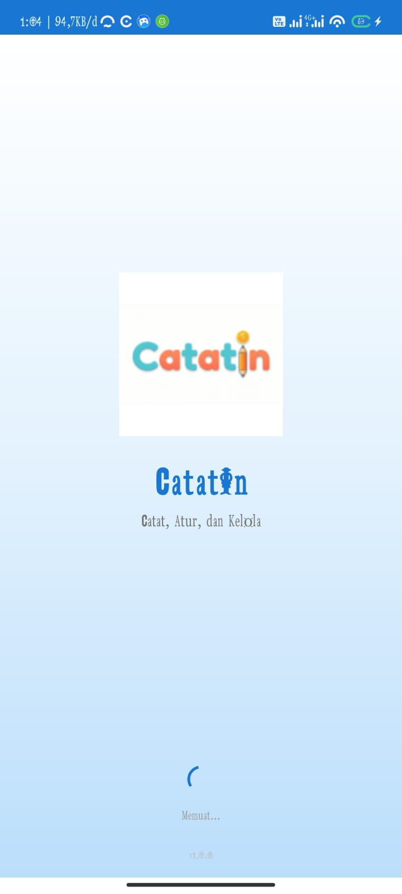
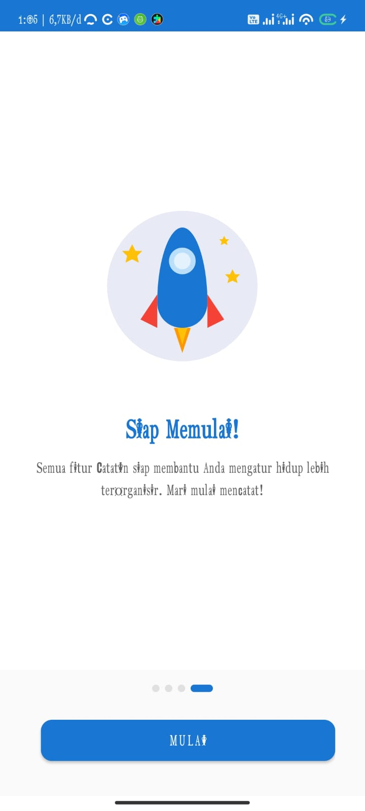
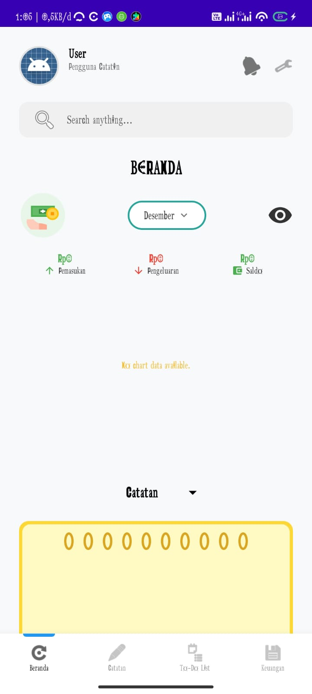
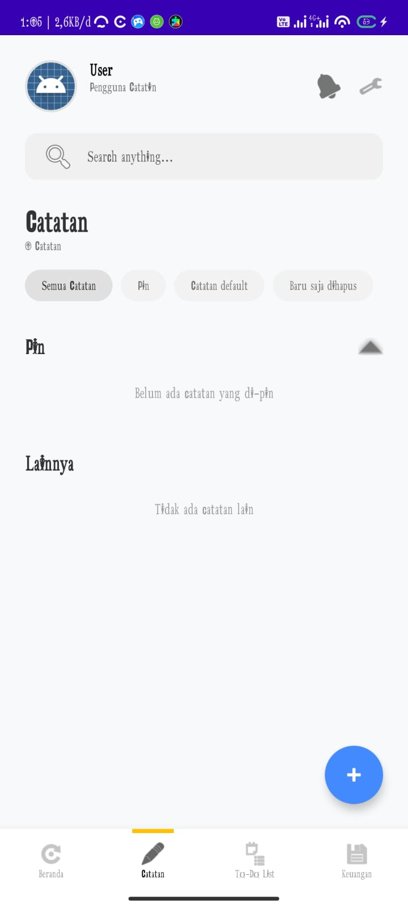
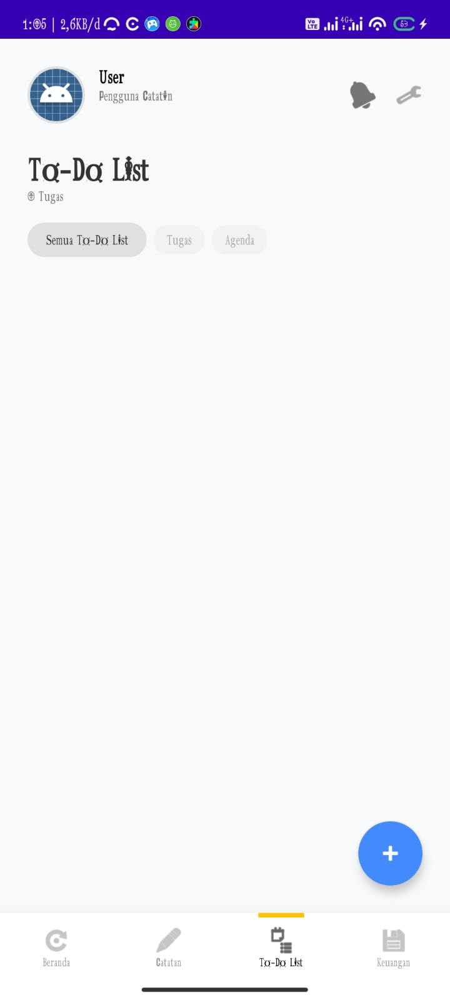
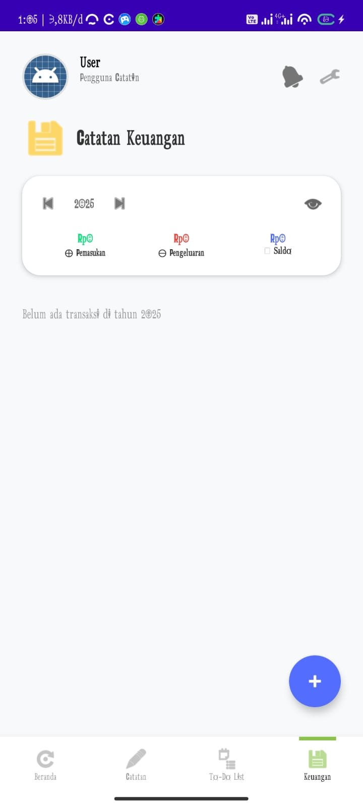

# 📱 CatatIn - Aplikasi Catatan Pintar


**CatatIn** adalah aplikasi Android all-in-one untuk mengelola catatan, to-do list, dan keuangan pribadi dengan tampilan modern dan user-friendly.

## ✨ Fitur Utama

### 🏠 Beranda (Dashboard)
- Overview keuangan dengan PieChart (Income vs Expense)
- Quick access ke catatan terbaru (tampilan notebook style)
- Preview to-do list dengan filter bulan/tahun
- Profil pengguna dengan foto yang dapat dikustomisasi

### 📝 Catatan (Notes)
- Membuat, mengedit, dan menghapus catatan teks
- Tampilan notebook dengan spiral binding aesthetic
- Search dan filter catatan
- Detail view dengan format yang rapi

### ✅ To-Do List
- CRUD operations untuk task management
- Priority system (Low, Normal, High, Urgent) dengan color coding
- Due date dengan date picker
- Mark complete/incomplete dengan visual feedback
- Filter berdasarkan bulan dan tahun
- Agenda view per tanggal

### 💰 Finance Tracker
- Track pemasukan (income) dan pengeluaran (expense)
- Category management untuk setiap transaksi
- Dashboard dengan summary balance real-time
- Riwayat transaksi dengan grouping per tanggal
- Format mata uang Rupiah (IDR)
- PieChart visualization

### 🎨 User Experience
- Onboarding screen untuk pengguna baru
- Splash screen dengan branding
- Smooth page transitions
- Material Design 3 components
- Bottom navigation yang intuitif

## 🛠️ Teknologi

| Komponen | Teknologi |
|----------|-----------|
| **Platform** | Android (API 24+ / Android 7.0) |
| **Language** | Kotlin |
| **Database** | Room (SQLite) |
| **Architecture** | Single Activity dengan multiple screens |
| **UI** | Material Design 3, ViewBinding |
| **Charts** | MPAndroidChart |
| **Image** | CircleImageView |

## 🏗️ Struktur Project

```
app/src/main/
├── java/com/alphacoms/catatin/
│   ├── data/              # Room database, entities, DAOs
│   │   ├── AppDatabase.kt
│   │   ├── Note.kt, NoteDao.kt
│   │   ├── ToDo.kt, ToDoDao.kt
│   │   ├── FinanceRecord.kt, FinanceDao.kt
│   │   └── PreferenceHelper.kt
│   ├── ui/                # Activities dan Adapters
│   │   ├── SplashActivity.kt
│   │   ├── OnboardingActivity.kt
│   │   ├── NotesActivity.kt
│   │   ├── ToDoListActivity.kt
│   │   ├── FinanceActivity.kt
│   │   └── SettingsActivity.kt
│   └── MainActivity.kt    # Beranda/Dashboard
├── res/
│   ├── layout/            # XML layouts
│   ├── drawable/          # Vector icons & backgrounds
│   ├── mipmap/            # App icons & logo
│   └── values/            # Colors, strings, themes
```

## 📱 Screenshots

| Splash | Onboarding | Beranda |
|--------|------------|---------|
|  |  |  |

| Notes | To-Do | Finance |
|-------|-------|---------|
|  |  |  |

## 🚀 Instalasi

### Prerequisites
- Android Studio Hedgehog (2023.1.1) atau lebih baru
- JDK 17
- Android SDK 24+

### Steps
1. Clone repository
   ```bash
   git clone https://github.com/username/catatin.git
   ```
2. Buka project di Android Studio
3. Sync Gradle dependencies
4. Run di device/emulator (minimum Android 7.0)

## 📦 Dependencies

```gradle
// Room Database
implementation "androidx.room:room-runtime:2.6.1"
implementation "androidx.room:room-ktx:2.6.1"
ksp "androidx.room:room-compiler:2.6.1"

// MPAndroidChart
implementation "com.github.PhilJay:MPAndroidChart:v3.1.0"

// CircleImageView
implementation "de.hdodenhof:circleimageview:3.1.0"

// Material Design
implementation "com.google.android.material:material:1.12.0"
```

## 👥 Tim Pengembang

**AlphaComs Team** - Tugas Akhir PAPB 2025

## 📄 License

```
Copyright © 2025 AlphaComs

Project ini dibuat untuk tugas akhir mata kuliah 
Pengembangan Aplikasi Perangkat Bergerak (PAPB).
```